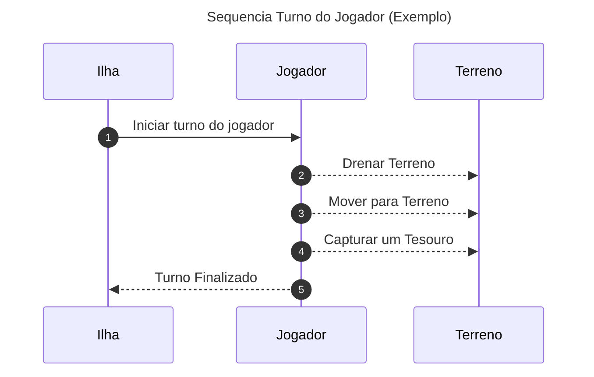

```mermaid
---
title: Sequencia Turno do Jogador (Exemplo)
---
sequenceDiagram
    autonumber
    Ilha->>Jogador: Iniciar turno do jogador
    Jogador-->>Terreno: Drenar Terreno
    Jogador-->>Terreno: Mover para Terreno
    Jogador-->>Terreno: Capturar um Tesouro
    Jogador-->>Ilha: Turno Finalizado
```